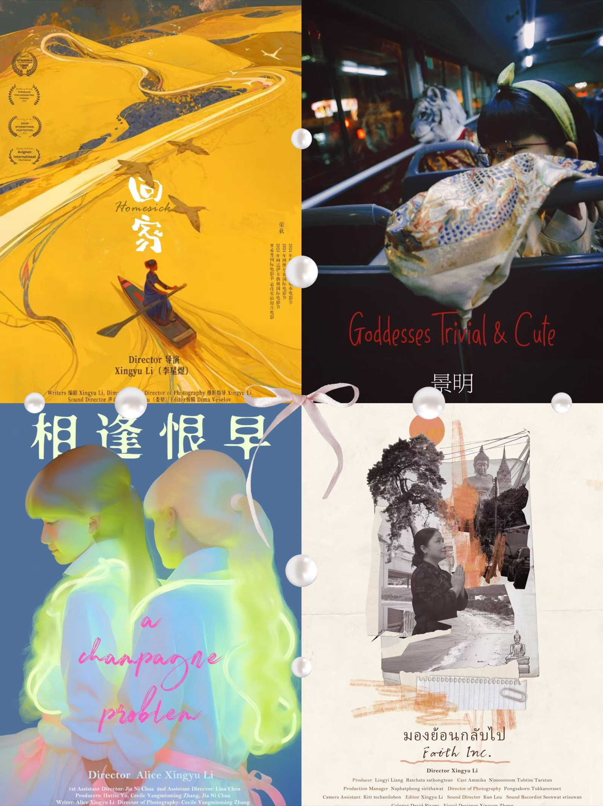
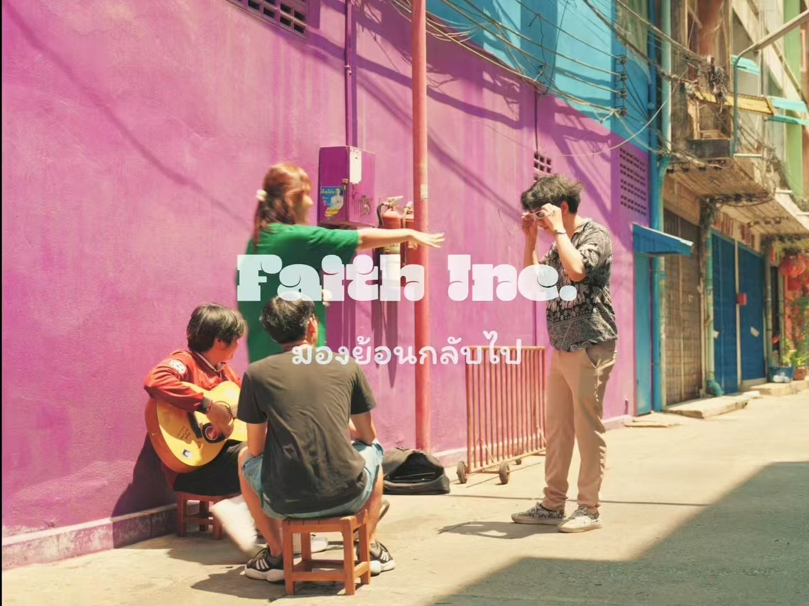

# Hey, I'm Alice 👋

> Make AI cool again.

I'm building **[Neuromantics](https://github.com/neuromantics-inc)** —
an AI-native operating system. A computer that knows you.
Only the things you love.

## 🪴 Currently

- 🌱 Building **Meadow**
- 🔬 Research @ [Stanford HAI Generative UI Group](https://github.com/Stanford-HAI-Generative-UI-Group)
- 🎬 Writing & filmmaking (still serious about both)

## 🌳 Background

- **Stanford** — Psychology, PhD (2021)
- **Stanford** — Political Science, MA (2018)
- **Tsinghua** — Psychology, BS (2015)

## 🌿 Research

> *Building AI for human flourishing. Auditing AI on humans.*

🏆 **Published in top general-science (*PNAS*) and AI venues (AAAI, UbiComp).**

📊 **1.2M+** participants · 🌏 **65** countries · 🤖 **67** AI systems audited

👥 Collaborators including [Mehran Sahami](https://profiles.stanford.edu/mehran-sahami) (Stanford), [Chenyu Zhang](https://www.chenyuzhang.com) (MIT Media Lab), [Rene Kizilcec](https://bowers.cornell.edu/people/rene-kizilcec) (Cornell), [Geoffrey L. Cohen](https://profiles.stanford.edu/geoffrey-cohen) (Stanford), and [Hazel Rose Markus](https://profiles.stanford.edu/hazel-markus) (Stanford)

- 🌏 **[Proceedings of the National Academy of Sciences (PNAS)](https://www.pnas.org/doi/abs/10.1073/pnas.2016964118)** (2021) — *Passion matters but not equally everywhere*. Predictive models on **1.2M adolescent participants across three international datasets and 59 societies** — quantified how the drivers of human achievement shift systematically by cultural context. Foundational evidence for why behavioral AI fails outside its training distribution. With Geoffrey L. Cohen and Hazel Rose Markus (Stanford).

- 🌿 **[AAAI 2026](https://ojs.aaai.org/index.php/AAAI/article/view/41283)** (AI for Social Impact) — *AI in the Wild: A Meta-Analytic Evaluation of Depression Detection from Social Media Data*. Systematically benchmarked **67 AI systems (2022–2025)** for social-media depression detection across transformer-based and multimodal architectures, quantifying the gap between benchmark accuracy and clinical validity (PHQ error, temporal stability, clinician agreement). Introduced a Psych-Aligned Evaluation Framework for deployment-ready mental-health AI.

- 🧠 **[UbiComp 2025](https://doi.org/10.1145/3714394.3754377)** — *Ubiquitous Well-being: Patchable AI Unites Computing and Psychological Science*. Proposed **Patchable AI** — a modular architecture where behavioral foundation models adapt continuously to individual psychology via lightweight, person-specific updates. With Geoffrey L. Cohen (Stanford).

- 🌾 **[arXiv preprint](https://arxiv.org/abs/2103.15212)** (2021) — *On the limits of algorithmic prediction across the globe*. Benchmarked state-of-the-art predictive models across **65 countries on 200 behavioral features** — accuracy decays linearly with target-country development index, a quantitative measure of out-of-distribution generalization failure in behavioral AI. With Rene F. Kizilcec (Cornell).

📚 [Google Scholar](https://scholar.google.com/citations?user=l1C8u3QAAAAJ) · 🆔 [ORCID 0000-0002-6674-119X](https://orcid.org/0000-0002-6674-119X)

## 🎬 Film

> 🏆 **Homesick** (2023, debut) — Best Indie Short Film @ **Hollywood** · Best Experimental Short Film @ **Avignon Int'l Film Festival** + **Paris Fantasy Film Festival**

**Filmography**

- 🎞 **Homesick** (回家) — 2023 · *debut*
- 🎞 **Goddesses Trivial and Cute** (景明) — 2023
- 🎞 **A Champagne Problem** (相逢恨早) — 2024
- 🎞 **Faith Inc.** — 2025

*A Champagne Problem* (2024)

*Faith Inc.* (2025)
